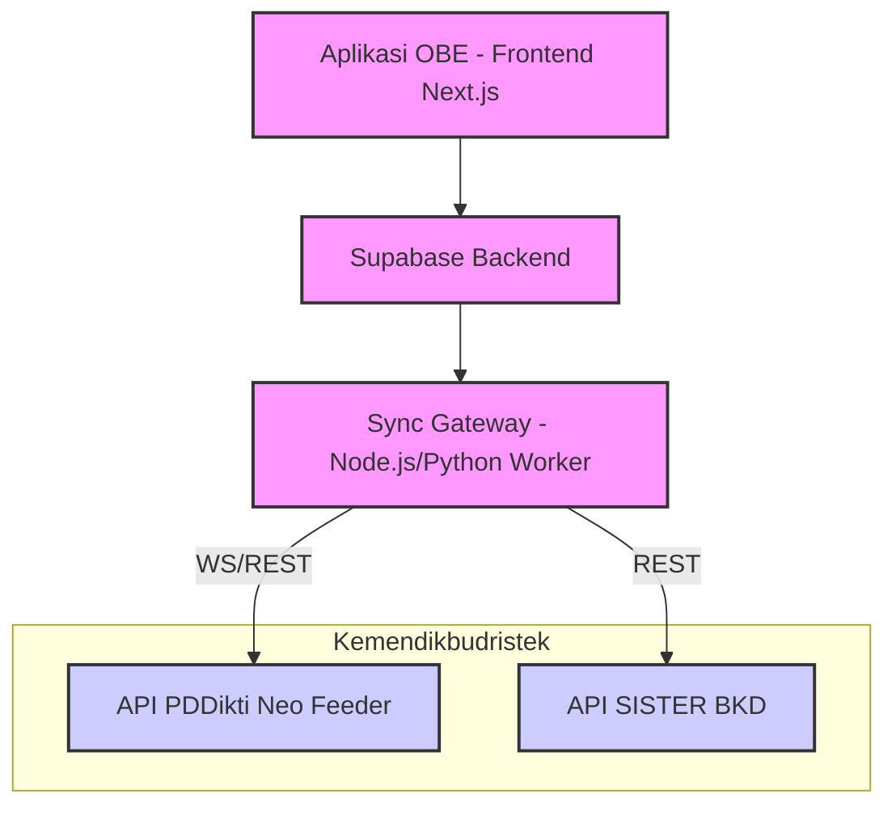

# Arsitektur Integrasi Nasional (OBE System)

Dokumen ini menjelaskan arsitektur integrasi aplikasi OBE (Outcome-Based Education) dengan sistem nasional Kemendikbudristek, yaitu **PDDikti Neo Feeder** dan **SISTER (Sistem Informasi Sumber Daya Terintegrasi)**. Hal ini sejalan dengan mandat Kepmendiktisaintek Nomor 358/M/KEP/2025.

## 1. Topologi Integrasi (Sync Gateway)

Aplikasi OBE tidak berinteraksi langsung (direct query) dengan database Neo Feeder atau SISTER, melainkan melalui sebuah **Sync Gateway (Middle-tier Service)**. Gateway ini bertugas sebagai fasilitator komunikasi API, manajemen kredensial, dan sinkronisasi data asinkron (background jobs).

## 2. Alur Sinkronisasi Data

### A. Integrasi PDDikti (Neo Feeder)
**Tujuan**: Sinkronisasi Kurikulum, Mata Kuliah, dan Nilai Mahasiswa.
- **Push Kurikulum (OBC)**:
  - Mata Kuliah, SKS, metode pembelajaran (terutama penanda TBP/CM untuk IKU 5) dikirim melalui endpoint *InsertMataKuliah* dan *InsertKurikulum* Neo Feeder.
- **Push Nilai (OBAE)**:
  - Setelah nilai akhir mahasiswa (berdasarkan kalkulasi Sub-CPMK) difinalisasi oleh dosen, Sync Gateway memicu sinkronisasi melalui endpoint *InsertNilaiPerkuliahanKelas*.
- **Mekanisme**: Job penjadwalan (cron) mingguan atau *trigger manual* oleh admin.

### B. Integrasi SISTER BKD
**Tujuan**: Pelaporan Beban Kerja Dosen berbasis luaran pembelajaran (OBLT & CQI).
- **Claim Aktivitas Pembelajaran**:
  - Sinkronisasi bukti pembuatan RPS Digital dan dokumen evaluasi (Rencana Aksi Perbaikan) yang tersimpan di sistem OBE.
- **Validasi Integritas (Audit Trail)**:
  - Data *Grading Audit Trail* (perubahan nilai, IKU 11) dapat direkam sebagai log kepatuhan aktivitas akademik dosen.

## 3. Penanganan Kegagalan (Fault Tolerance)
- **Retry Mechanism**: Sinkronisasi yang gagal akibat *timeout* dari server Neo Feeder/SISTER akan di-retry menggunakan *Exponential Backoff*.
- **Idempotency**: Seluruh operasi Sync API harus *idempotent* untuk menghindari duplikasi pelaporan mata kuliah atau nilai mahasiswa.
- **Monitoring (Dashboard)**: Menyediakan dashboard khusus (Sync Status) bagi admin perguruan tinggi untuk memantau keberhasilan atau kegagalan *push* API ke sistem kementerian.
